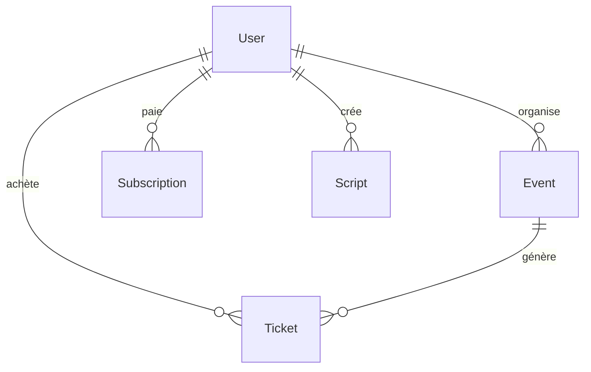

# 🏗️ Architecture MO5 - Vue d'ensemble

## 🎯 Vision du Système

MO5 est un **espace membre complet** pour l'association MO5, conçu pour gérer tous les aspects organisationnels avec une approche moderne et sécurisée.

## 🏛️ Architecture Générale

### Stack Technologique

- **Frontend** : SolidJS + SolidStart (SSR/SSG)
- **Backend** : SolidStart API Routes
- **Base de données** : MySQL + Drizzle ORM
- **Authentification** : Auth.js + Discord OAuth
- **Styling** : Tailwind CSS v4
- **Éditeur** : EditorJS pour contenu riche

### Principes Architecturaux

1. **Domain-Driven Design (DDD)** : Organisation par domaines métier
2. **Feature-Based Structure** : Chaque feature est autonome
3. **Colocation** : Tests et code métier ensemble
4. **Separation of Concerns** : UI, logique métier, et données séparées

## 🏢 Niveaux d'Accès

### 🌐 Public

- **Billeterie** pour expositions
- **Événements publics** à venir
- **Informations** sur l'association

### 👤 Membre

- **Tableau de bord** personnel
- **Inscription aux événements** (Doodle-like)
- **Historique** des participations
- **Gestion du profil**

### 🏢 Bureau

- **Gestion des événements** (création, modification)
- **Gestion des membres** et rôles
- **Gestion des cotisations**
- **Rapports** et statistiques

### 🎬 Pôles Spécialisés

- **Pôle Live/Vidéo** : Scripts, planning, ressources
- **Autres pôles** : Outils selon besoins spécifiques

### 👑 Admin

- **Accès complet** au système
- **Gestion des rôles** Discord
- **Configuration** système

## 🔐 Système d'Authentification

### Discord OAuth

- **Provider unique** : Discord de l'association
- **Rôles Discord** : Mappés vers permissions système
- **Session sécurisée** : JWT + cookies httpOnly

### Rôles et Permissions

```typescript
interface Role {
  name: string
  permissions: Permission[]
  discordRole: string
}

interface Permission {
  resource: string
  actions: ('read' | 'write' | 'delete' | 'admin')[]
}
```

## 📊 Architecture des Données

### Entités Principales

1. **User** : Utilisateurs (membres, bureau, etc.)
2. **Event** : Événements (publics, privés, formations)
3. **Ticket** : Billets pour événements
4. **Subscription** : Cotisations des membres
5. **Collection** : Objets de la collection
6. **Script** : Scripts pour pôle Live/Vidéo

### Relations



## 🏗️ Structure des Features

### Pattern Feature

Chaque feature suit le pattern :

```
features/
├── feature-name/
│   ├── feature-name.api.ts      # Routes API
│   ├── feature-name.store.ts    # État et logique métier
│   ├── feature-name.hook.ts     # Hooks SolidJS
│   ├── feature-name.view.tsx    # Composants UI
│   ├── feature-name.types.ts    # Types TypeScript
│   ├── feature-name.utils.ts    # Utilitaires
│   ├── feature-name.test.ts     # Tests
│   └── feature-name.feature     # Documentation
```

### Exemple : Feature Events

```typescript
// events.store.ts - Logique métier
export class EventsStore {
  async createEvent(data: CreateEventData): Promise<Event> {
    // Validation métier
    // Appel API
    // Mise à jour état
  }
}

// events.hook.ts - Hooks SolidJS
export function useEvents() {
  const [events, setEvents] = createSignal<Event[]>([])
  const store = new EventsStore()

  return {
    events: events(),
    createEvent: store.createEvent.bind(store),
  }
}

// events.view.tsx - Composants UI
export function EventsList() {
  const { events } = useEvents()

  return (
    <div>
      {events().map((event) => (
        <EventCard event={event} />
      ))}
    </div>
  )
}
```

## 🔄 Flux de Données

### Pattern de Communication

1. **UI** → **Hook** → **Store** → **API**
2. **API** → **Database** → **Store** → **Hook** → **UI**

### Gestion d'État

- **Signals SolidJS** : État réactif local
- **Stores** : Logique métier centralisée
- **Context** : État global partagé (auth, etc.)

## 🛡️ Sécurité

### Authentification

- **Discord OAuth** : Provider unique et sécurisé
- **JWT** : Tokens sécurisés avec expiration
- **CSRF Protection** : Protection contre les attaques

### Autorisation

- **RBAC** : Role-Based Access Control
- **Permissions granulaires** : Par ressource et action
- **Validation côté serveur** : Toujours vérifier les permissions

### Données

- **Chiffrement** : Données sensibles chiffrées
- **Validation** : Zod pour validation des données
- **Sanitization** : Nettoyage des entrées utilisateur

## 📱 Responsive Design

### Mobile-First

- **Tailwind CSS** : Classes utilitaires responsive
- **Breakpoints** : sm, md, lg, xl, 2xl
- **Touch-friendly** : Interfaces adaptées mobile

### Performance

- **Code Splitting** : Chargement à la demande
- **Lazy Loading** : Composants chargés quand nécessaire
- **Caching** : Mise en cache des données fréquentes

## 🧪 Tests

### Stratégie de Tests

- **Unit Tests** : Logique métier dans les stores
- **Integration Tests** : APIs et base de données
- **E2E Tests** : Flux utilisateur complets

### Outils

- **Vitest** : Framework de tests
- **Testing Library** : Tests de composants
- **MSW** : Mock des APIs

## 🚀 Déploiement

### Environnements

- **Development** : Local avec hot reload
- **Staging** : Environnement de test
- **Production** : Environnement live

### CI/CD

- **GitHub Actions** : Automatisation
- **Tests automatiques** : Sur chaque PR
- **Déploiement automatique** : Sur merge main

---

Cette architecture évolue avec les besoins du projet tout en maintenant la cohérence et la maintenabilité.
